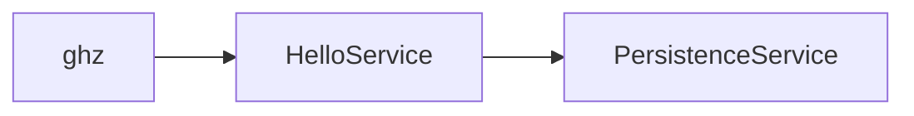

# gRPC JDK 21 Perf Benchmark



* `HelloService` is a simple unary gRPC service that performs a blocking call to `PersistenceService` to retrieve a
  greeting counter.
* `PersistenceService` simulates a long blocking I/O operation with `Thread.sleep(1000)`.
* `ghz` is used to benchmark the performance of `HelloService` with different thread pool executors.

## Pre-requisites

* [ghz](https://ghz.sh/docs/intro)

```shell
brew install ghz
```

* Java 21

```shell
asdf install java zulu-21.30.15
```

* Start the `PersistenceService`

```shell
mvn compile exec:java -Dexec.mainClass="com.example.grpc.application.PersistenceServiceApplication"
```

## Benchmark

### Default (CachedThreadPoolExecutor)

* Start the server

```shell
mvn compile exec:java -Dexec.mainClass="com.example.grpc.application.HelloServiceDefaultExecutor"
```

* Run the benchmark

```shell
ghz --insecure --call com.example.grpc.HelloService.SayHello -d '{"name": "World!"}' --concurrency=5000 --total 10000 localhost:9901
```

* Summary

```
Summary:
  Count:        10000
  Total:        20.20 s
  Slowest:      2.48 s
  Fastest:      1.03 s
  Average:      3.57 s
  Requests/sec: 494.97

Response time histogram:
1031.762 [1]    |
1176.954 [444]  |∎∎∎∎∎∎
1322.146 [94]   |∎
1467.338 [354]  |∎∎∎∎∎
1612.530 [593]  |∎∎∎∎∎∎∎∎
1757.722 [1199] |∎∎∎∎∎∎∎∎∎∎∎∎∎∎∎
1902.914 [1958] |∎∎∎∎∎∎∎∎∎∎∎∎∎∎∎∎∎∎∎∎∎∎∎∎∎
2048.106 [3143] |∎∎∎∎∎∎∎∎∎∎∎∎∎∎∎∎∎∎∎∎∎∎∎∎∎∎∎∎∎∎∎∎∎∎∎∎∎∎∎∎
2193.297 [205]  |∎∎∎
2338.489 [0]    |
2483.681 [1065] |∎∎∎∎∎∎∎∎∎∎∎∎∎∎

Latency distribution:
10 % in 1.52 s
25 % in 1.73 s
50 % in 1.90 s
75 % in 1.95 s
90 % in 2.36 s
95 % in 2.40 s
99 % in 2.41 s

Status code distribution:
[OK]                 9056 responses
[DeadlineExceeded]   944 responses

Error distribution:
[944]   rpc error: code = DeadlineExceeded desc = context deadline exceeded
```

* Cause of error

```
java.lang.OutOfMemoryError: unable to create native thread: possibly out of memory or process/resource limits reached
```

### Current (ThreadPoolExecutor)

* Start the server

```shell
mvn compile exec:java -Dexec.mainClass="com.example.grpc.application.HelloServiceThreadPoolExecutor"
```

* Run the benchmark

```shell
ghz --insecure --call com.example.grpc.HelloService.SayHello -d '{"name": "World!"}' --concurrency=5000 --total 10000 localhost:9902
```

* Summary

```
Summary:
  Count:        10000
  Total:        40.06 s
  Slowest:      2.38 s
  Fastest:      1.00 s
  Average:      12.30 s
  Requests/sec: 249.62

Response time histogram:
  1002.191 [1]    |
  1139.954 [3599] |∎∎∎∎∎∎∎∎∎∎∎∎∎∎∎∎∎∎∎∎∎∎∎∎∎∎∎∎∎∎∎∎∎∎∎∎∎∎∎∎
  1277.717 [0]    |
  1415.481 [200]  |∎∎
  1553.244 [0]    |
  1691.008 [0]    |
  1828.771 [78]   |∎
  1966.535 [0]    |
  2104.298 [0]    |
  2242.062 [0]    |
  2379.825 [200]  |∎∎

Latency distribution:
  10 % in 1.01 s
  25 % in 1.01 s
  50 % in 1.02 s
  75 % in 1.04 s
  90 % in 1.31 s
  95 % in 1.81 s
  99 % in 2.36 s

Status code distribution:
  [DeadlineExceeded]   5922 responses
  [OK]                 4078 responses

Error distribution:
  [5922]   rpc error: code = DeadlineExceeded desc = context deadline exceeded
```

* Cause of error

```
22:05:17.851 [grpc-nio-worker-ELG-1-2] WARN  c.e.g.a.HelloServiceThreadPoolExecutor - request rejected from executor.
```

### Proposed (VirtualThreadExecutor)

* Start the server

```shell
mvn compile exec:java -Dexec.mainClass="com.example.grpc.application.HelloServiceVirtualThreadExecutor"
```

* Run the benchmark

```shell
ghz --insecure --call com.example.grpc.HelloService.SayHello -d '{"name": "World!"}' --concurrency=5000 --total 10000 localhost:9903
```

* Summary

```
Summary:
  Count:        10000
  Total:        2.79 s
  Slowest:      1.69 s
  Fastest:      1.00 s
  Average:      1.29 s
  Requests/sec: 3579.92

Response time histogram:
  1002.359 [1]    |
  1071.295 [1130] |∎∎∎∎∎∎∎∎∎∎∎∎∎∎∎∎
  1140.231 [2878] |∎∎∎∎∎∎∎∎∎∎∎∎∎∎∎∎∎∎∎∎∎∎∎∎∎∎∎∎∎∎∎∎∎∎∎∎∎∎∎∎
  1209.166 [979]  |∎∎∎∎∎∎∎∎∎∎∎∎∎∎
  1278.102 [16]   |
  1347.038 [301]  |∎∎∎∎
  1415.973 [442]  |∎∎∎∎∎∎
  1484.909 [1469] |∎∎∎∎∎∎∎∎∎∎∎∎∎∎∎∎∎∎∎∎
  1553.845 [2518] |∎∎∎∎∎∎∎∎∎∎∎∎∎∎∎∎∎∎∎∎∎∎∎∎∎∎∎∎∎∎∎∎∎∎∎
  1622.780 [244]  |∎∎∎
  1691.716 [22]   |

Latency distribution:
  10 % in 1.06 s
  25 % in 1.11 s
  50 % in 1.21 s
  75 % in 1.49 s
  90 % in 1.53 s
  95 % in 1.54 s
  99 % in 1.58 s

Status code distribution:
  [OK]   10000 responses
```

* How able 10x the load?

```shell
ghz --insecure --call com.example.grpc.HelloService.SayHello -d '{"name": "World!"}' --concurrency=50000 --total 100000 localhost:9903
```

```
Summary:
  Count:        100000
  Total:        7.36 s
  Slowest:      5.71 s
  Fastest:      1.09 s
  Average:      2.65 s
  Requests/sec: 13582.45

Response time histogram:
  1091.384 [1]     |
  1552.803 [10871] |∎∎∎∎∎∎∎∎∎∎∎∎∎∎∎∎∎∎∎∎
  2014.222 [17107] |∎∎∎∎∎∎∎∎∎∎∎∎∎∎∎∎∎∎∎∎∎∎∎∎∎∎∎∎∎∎∎∎
  2475.640 [21308] |∎∎∎∎∎∎∎∎∎∎∎∎∎∎∎∎∎∎∎∎∎∎∎∎∎∎∎∎∎∎∎∎∎∎∎∎∎∎∎∎
  2937.059 [12270] |∎∎∎∎∎∎∎∎∎∎∎∎∎∎∎∎∎∎∎∎∎∎∎
  3398.478 [11670] |∎∎∎∎∎∎∎∎∎∎∎∎∎∎∎∎∎∎∎∎∎∎
  3859.896 [18593] |∎∎∎∎∎∎∎∎∎∎∎∎∎∎∎∎∎∎∎∎∎∎∎∎∎∎∎∎∎∎∎∎∎∎∎
  4321.315 [5175]  |∎∎∎∎∎∎∎∎∎∎
  4782.733 [2989]  |∎∎∎∎∎∎
  5244.152 [7]     |
  5705.571 [9]     |

Latency distribution:
  10 % in 1.49 s
  25 % in 1.95 s
  50 % in 2.49 s
  75 % in 3.53 s
  90 % in 3.78 s
  95 % in 4.20 s
  99 % in 4.44 s

Status code distribution:
  [OK]   100000 responses
```